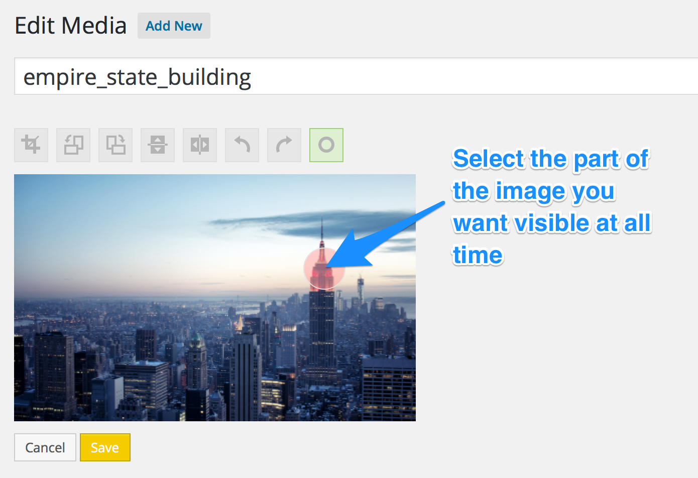

<!-- DO NOT EDIT THIS FILE; it is auto-generated from readme.txt -->
# Image Hotspot

**Contributors:** [jonathanbardo](http://profiles.wordpress.org/jonathanbardo)  
**Tags:** [thumbnails](http://wordpress.org/plugins/tags/thumbnails), [image](http://wordpress.org/plugins/tags/image), [resize](http://wordpress.org/plugins/tags/resize)  
**Requires at least:** 4.3  
**Tested up to:** 4.3  
**Stable tag:** trunk (master)
**License:** [GPLv2 or later](http://www.gnu.org/licenses/gpl-2.0.html)  

## Description ##

A plugin that helps you control how WordPress generates the various image size in your site using a specific point that you want to be visible at all time no matter the image size.

**Development of this plugin is done [on GitHub](https://github.com/jonathanbardo/wp-image-hotspot). Pull requests welcome.**

## Screenshots ##

### Demonstration of hotspot point in image editing screen.

## Changelog ##

### 0.1.0 ###
Initial release
